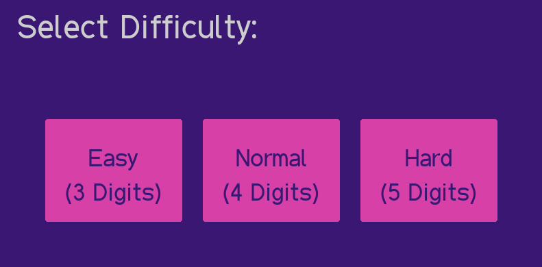
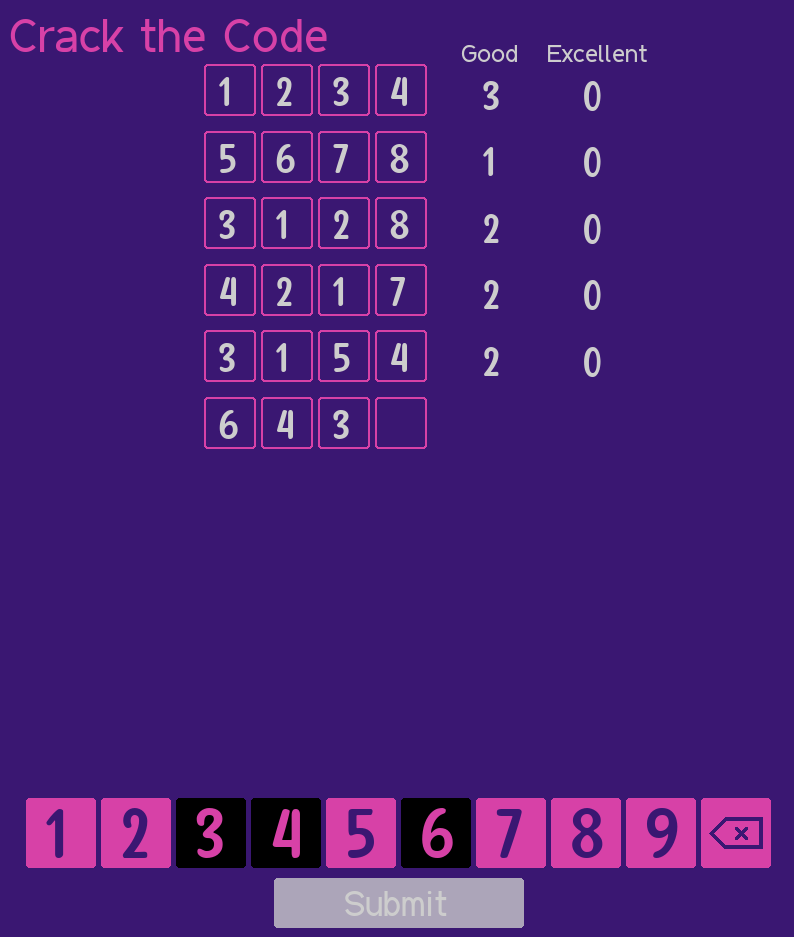
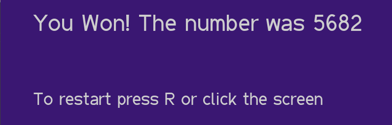

# Crack the Code

Crack the Code is a very simple game, your objective is to find the unknown 4 digit code.

To do this you have 10 chances to input whatever code you like and from that you get to know the amount of characters that are in the correct position (Excelent characters) and the amount that are in the number but not in the correct position (Good Characters).

The interesting part is that you only know the amount, you don't know which specific character is or isn't in the code. It's up to you which strategy to use to determine the right code.

### Details
- The code is composed of 4 non-repeating non-zero digits. Because of this you can't input a number with repeated digits or zero in it.
- Good and Excelent numbers don't stack up, this means that if, for example, the code is 1234 and you guess 1243 you will get 2 Good and 2 Excelent, not 4 Good and 2 Excelent like some may think.

You can download the game from the [Releases Page](https://github.com/tdominguez33/CrackTheCode/releases) (Windows only).

### Screenshots

